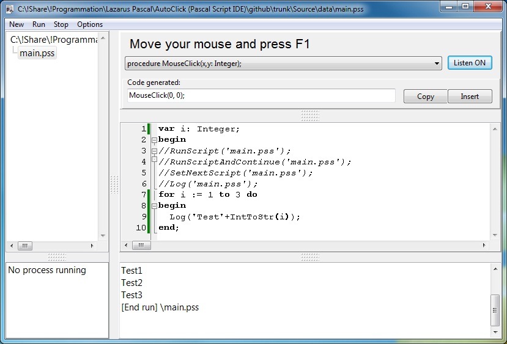
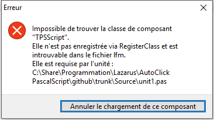
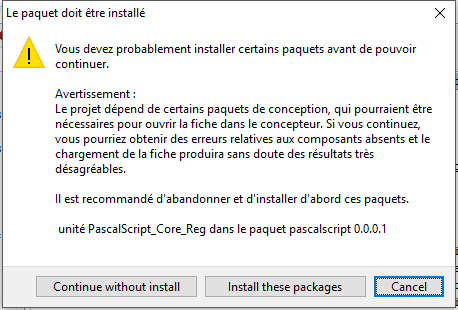

# AutoClick (Pascal Script Compiler)



## Download
  https://github.com/ddeeproton/AutoClick-Pascal-Script-IDE-/raw/master/Source/AutoClick_PascalScriptIDE.exe
  
## Source 
  https://github.com/ddeeproton/AutoClick-Pascal-Script-IDE-/archive/master.zip
  
## Compilator
  https://www.lazarus-ide.org/
  
## Description
If you know Pascal programming language, with AutoClick you can set automatic clicks on your Windows computer. Special functions for mouse and screen controling are added in this project. And a generator code is aviable to help coding Pascal Scripts. 

## Functions and Procedures you can use
```
function getColorHexPositionPix(x,y: Integer):String;
procedure MouseClick(x,y: Integer);
procedure waitColorHexPositionPix(x,y: Integer; hex:String);
procedure waitColorHexPositionPix2(x,y: Integer; hex:String; x2,y2: Integer; hex2:String);
procedure waitNotColorHexPositionPix(x,y: Integer; hex:String);
procedure waitNotColorHexPositionPix2(x,y: Integer; hex:String; x2,y2: Integer; hex2:String);
function play(x1,y1: Integer; c1:String; x2,y2: Integer; c2:String; x,y:Integer):Boolean;
procedure ExecAndContinue(sExe, sFile: string)
function KillTask(ExeFileName: string): Integer;
function ReadFromFile(Filename: string):String;
procedure WriteInFile(Filename, txt: string);
function makeDir(path:string):Boolean;'); 
procedure MouseMove(x,y: Integer);
procedure MouseMoveRelative(x,y: Integer);
procedure MouseDown();
procedure MouseUp();
function FileExists(Const FileName:String): Boolean;
function EraseFile(Const FileName:String): Boolean;
function getMousePosX(): Integer;
function getMousePosY(): Integer;
function getClipboard: String;   
procedure setClipboard(txt: String);
procedure PressControlA;
procedure PressControlC;
procedure PressControlV;   
function LocalhostClientMessage(ServerName, message: String):Boolean;
function LocalhostServerStart(ServerName:String):Boolean;
function LocalhostServerStop:Boolean;
function LocalhostServerStatus:Boolean;
function LocalhostServerMessage: String;
function LocalhostServerMessageWait: String; 
```
## Install librairy

### TPSScript

 -> 

Open "unit1.pas" and Press "F12". And click "Install these packages"


## Changes

### v 0.2
Allow to start a pascal script on application start, if a ".pss" file is set in parameter to AutoClick_PascalScriptIDE.exe 

Like this (Batch script):
```
AutoClick_PascalScriptIDE.exe "myscript.pss" 
```
You can also copy "AutoClick_PascalScriptIDE.exe" into a new name, and manage it from PascalScript code:

Like this (Pascal Script):
```
ExecAndContinue('AutoClick_PascalScriptIDE_2.exe','MyScriptToStart.pss /');

KillTask('AutoClick_PascalScriptIDE_2.exe'); 
```

### v 0.3
New functions are added:
```
  procedure MouseMove(x,y: Integer);
  procedure MouseDown();
  procedure MouseUp();
```
### v 0.4
New function is added
```
  procedure MouseMoveRelative(x,y: Integer);
```
### v 0.5
Function modified
```
  procedure MouseDown(x,y: Integer);
  procedure MouseUp(x,y: Integer);
```
### v 0.6
New function is added
```
  function PrintScreen(filename: String): Boolean;  
```

### v 0.7
Bug fix with PrintScreen. On repeated call.
 
### v 0.8
Bug fix - Current default path is set to database directory
New function is added
```
  function FileExists(Const FileName:String): Boolean;
```

### v 0.9
New functions are added
```
  function getMousePosX(): Integer;
  function getMousePosY(): Integer;
```

### v 0.10
Add relative path in exemples for creation new script
New functions are added
```
  function EraseFile(Const FileName:String): Boolean;
  function getClipboard: String;
  procedure setClipboard(txt: String);
```
### v 0.11
New functions are added
```
  procedure PressControlA;
  procedure PressControlC;
  procedure PressControlV;   
```
### v 0.12
New functions are added
```
  function ClientMessage(ServerName, message: String):Boolean;
  function ServerStart(ServerName:String):Boolean;
  function ServerStop:Boolean;
  function ServerStatus:Boolean;
  function ServerMessage: String;
  function ServerMessageWait: String;   
```
### v 0.13
Rename functions into
```
function LocalhostClientMessage(ServerName, message: String):Boolean;
function LocalhostServerStart(ServerName:String):Boolean;
function LocalhostServerStop:Boolean;
function LocalhostServerStatus:Boolean;
function LocalhostServerMessage: String;
function LocalhostServerMessageWait: String; 
```
### v 0.14
Add news functions
```
procedure HTTPServerStart(ipServ: String; portServ: Integer; scriptFileServ: String);
procedure HTTPServerStop;
function HTTPServerMessage:String;
function HTTPClientMessage(ip: String; Port: Integer; Message: String):String; 
```
How to use:

ServerStart.pss
```
HTTPServerStart('127.0.0.1',88,'ServerMessage.pss');
```
ServerMessage.pss
```
Log(HTTPServerMessage); // Hello
```
ClientMessage.pss
```
HTTPClientMessage('127.0.0.1',88,'Hello');
```
### v 0.15 
HTTPServer and HTTPClient talk now in base64 to allow multiples lines in message

### v 0.16 
Add news functions
```
function HTTPGet(ip: String; Port: Integer; Message: String):String; 
```
Same than HTTPClientMessage but without base64 encoding (use this fonction to get web page)